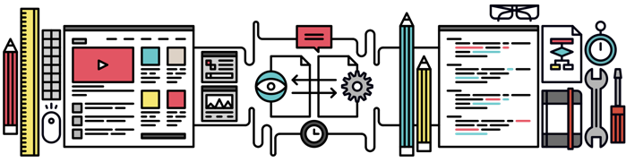
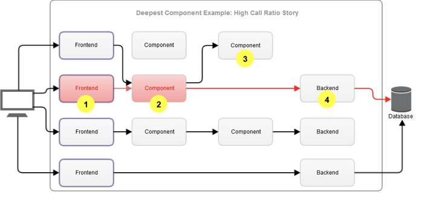

Hızla gelişen teknolojiler içerisinde araştırma yapmak, mevcutta kullandığımız sisteme veya sistemlere katkı sağlamak adına birçok efor sarf ediyoruz. Efor’u doğru kullanabilmek önemli.

Peki bunu nasıl sağlarız? Bunun hakkında gelin birlikte göz atalım maddelere…

## 1- x proje için yeni bir hayat & hayatta olan bir proje için ön araştırmalar
Bu aşamada iki türlü bir araştırma kapsamı ortaya çıkmakta.

- a. Proje yeni bir projemi.
- b. Proje hayatta olan bir proje ve hayatta olan projeye katkısı.. Kısacası bir ön araştırma.

Her iki durum için ürün ve front end bir araya gelir ve konu veya konular ile ilgili başlıklar çıkarmaktadır. Ürüncü, tasarım ile ilgili özellikleri ortaya koyması için, front end ise tasarım’a uygun altyapı ve sürdürülebilme çalışması için fikir alışverişi yapılır.

## 2- Tasarım süreci

Yeni bir proje veya hayatta olan bir projeye gelecek yeni özelliklerin tasarım süreci bazen süreci uzatabilir. Nedeni ise, Her tasarımın front end karşılığı olmamasından kaynaklı. Bunun sebebi de tasarım’ın web standartlarına uyup uymamasından geçiyor.

Tasarım sürecine geçilirken, projenin hem ürün bazında hem de front end bazında etkilerini ortaya koymak gerekmektedir. Bunu bir önceki madde’ye örnek ile vermiştik.

Mesela, kullanıcı alışkanlıkları, sitenin tasarımı grid yapısına uygunluğu, responsive desteği, mevcuttaki projenin sürdürülebilir olması için modular web design desteğinin olması çok önemli.

## 3- Ön gereksinimler ve analiz

Tasarım süreci araştırmasında, ortaya konulan fikirle ilgili ön araştırma ve bu fikrin proje üzerinde incelenmesini kapsar.

Tam anlamı ile projenin tasarımı yapılır, sonrasında bir inceleme. Yeni yapılacak proje için altyapı veya mevcutta olan bir projenin alt yapısına uygunluğunun analiz etmek.

## 4- Spesifikasyon ve gereksinim analizi

Bir önceki konu da fikirler doğrultusun da, ürün’ün tasarımı ve bu tasarım üzerinde olacak, oluşabilecek noktaları ayrıntılı bir şekilde inceledik.

Şimdi ise front end için gereksinimler devreye giriyor.

Tasarım süreçlerinde fizibilite araştırmalarını yaptıktan sonra teknik özelliklerin saplanması.

Front end ekibinin bir araya gelerek, proje de kullanılacak teknoloji seçimi veya metodolojigibi teknik özelliklere dayalı kullanılacak sistemin fonksiyonel ve işlevsel özelliklerine dair detaylı gereksinim analizi çıkarmasını sağlar.

Bunun içinde, tasarım incelenerek bir diagram çıkarılır.

## 5- Proje diagram’ı

Proje’ye ait yazılımın ve mimarinin çizildiği ve net kırılımlarının belirlendiği aşamadır.

Her projenin altyapısı çoğu zaman uyumlu teknolojiler ve mimariler ile kesişir.

Bu yüzden front-end kısmına ek olarak proje diagramı çıkarılırken, back-end developer’lar ile entegre çalışmaktadır. Sadece arayüz değil, arayüz’e bağlı olarak sağlıklı çalışan bir sistemi ayakta tutmak bundan geçiyor.

Örneğin, Kullanıcı bir butona bastığında onun aksiyonu backend bazında da ilgilendirmekte. Bir login işleminde veya kullanıcı üye olduğunda, kullanıcı butona bastığı anda, front end tarafından kullanıcı bilgileri backend’e gönderilir ve db’de daha önce böyle bir kullanıcı var mı yok mu diye sorgulama yapılır. En basit örnek olarak bunu düşünebiliriz. Front end ile back end arasında tasarım’ın sürecine dahil olması dışında back end’e de dahil olması gerekmektedir.

Diagram çizilmesindeki amaç, yazılımsal olarak zaman açısından olumlu olarak sürece etki etmesi ve birçok kesişen modules yapının saplanmasını sağlar.

Aksi taktirde, frontend için yapılan yeni özellikler backend kısmında da yapılması anlamına gekir. Bu yüzden en başından, en sonuna kadar.. Ki en sonuna demek doğru değil, doğru olan geliştirilebilir olmasına dikkat ederek ilerlemeliyiz

## 6- Geliştirme ve kodlama

Diagram aşamasını ve net olacak kırılımları ayırdıktan sonra yazılım kısmının modeline göre, kodların yazılması ve bunun sonucunda ürün’ün ortaya çıkması aşamasıdır.

## 7- Peki bunları yapmasaydık?

*EVETTTTTT! HARİKA BİR İŞ ÇIKARDIK ARKADAŞLAR. HERŞEY HARİKA PROJELER ZAMANINDA YETİŞİYOR…*

Tasarım süreci ile fe sürecinin birbirinden farklı olduğunu düşünelim? Tamamen bir önceki anlattıklarımı düşünmeden ilerlemeyi planlayalım

Konuya giriş yaparken x proje için yeni hayat, hayatta olan bir proje için araştırmalar konusuna değinmiştim. Proje’nin herhangi bir yaşam döngüsü olmadan ilerlediğinde bu durum, oluşabilecek sorunlara katlanmak, efor ve zamana olumsuz olarak etki eder. Bu da yazılım sürecini de etkilemektedir. Projenin sağlıklı ilerlemesi, projenin hızla bitmesi ile eşdeğer değildir. Bunun analiz süreçleri işi daha da kolaylaştırmayı hedeflediği içindir.

Bu sebeple hızlı iş başarmak tabiri yerine projede ön araştırma metodolojisi ile ilerlemek her zaman avantaj sağlayacaktır.

## 8- Sürdürülebilir gelenekler

Proje süreçlerine bağlı kalarak tam anlamı ile geliştirilebilir bir mimarinin tanımını yapmak bazen zor olabiliyor. Biz tüm risk’leri ortadan kaldırmak için, tabiki proje üzerinde bir analiz, tasarım süreci ve yaşam döngüsünü bir kültür olarak benimsememiz gerekmekte.

Yeni gelen projeler, mevcutta iyileştirilecek projeler derken hayat bir şekilde akıp gidiyor. Peki bu akıp giden hayatta biz her zaman yeni projeler veya hayattaki projeler için yeni özellikler mi geliştireceğiz?

Gün geçtikçe ister yeni olsun ister mevcutta bir proje olsun genel yeni özellikler, kural dışı geliştirildiğinde kasvetli sonuçlarla dönüşebiliyor. Biz bu riskleri ortadan kaldırmak için sürdürülebilirliği benimsememiz gerekmektedir.

