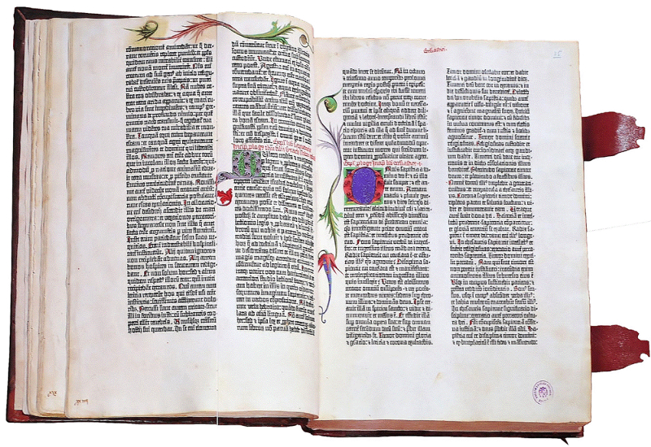

osman selvii..

## The first transition

A similar conflict emerged after the invention of the first printing press in Europe. Johannes Gutenberg invented movable type and used it to produce different compositions. His workshop could print up to 240 impressions per hour. Until then, the books were being copied by hand. All the books were handwritten and decorated with hand drawn ornaments and figures. A process of copying a book was long but each book, even a copy, was a work of art.

The first printed books were, at first, perceived as inferior to the handwritten ones. They were smaller and cheaper to produce. Movable type provided the printers with flexibility that allowed them to print books in languages other than Latin. Gill describes the transition to industrialism as something that people needed and wanted. Something similar happened after the first printed books emerged. People wanted books in a language they understood and they wanted books they could take with them. They were hungry for knowledge and printed books satisfied this hunger.

