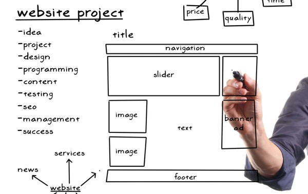

Facebook ve Instragram’ın biriciği React.js, basitliği, ölçeklenebilirliği ve yüksek performans vaadiyle günümüz Web uygulamalarında sıklıkla tercih ediliyor. React.js SPA (Single Page Applications) ve Redux kavramlarına inceleyeceğiz ve projedeki react.js yol haritasını inceleyerek yaşam döngüsünü gözden geçireceğiz.

Günümüzde sıklıkla geliştirilen javascript kütüphane/framework çalışma ortamlarını gözden geçiriyoruz. Neden React.js? Proje/projelere avantajları nelerdir bunları inceleyelim.

# Konu Başlıklarımız
- Sanal DOM
- React ve JSX
- React Eleman ve Bileşenleri
- React Yaşam Döngüsü
- React props ve state yapısı
- React Router
- Redux
- Sanal Dom
- React direk DOM uzerinde degisiklik yapmak yerine Virtual DOM uzerinde degisiklikleri yapmaktadır.

Dom ile uğraşmak her defasında dom üzerinde bir işlemin değişikliği zaman almakta. Her hangi bir class veya id değişikliği DOM’un tekrar incelenmesi demektir.

Bunun yerine performansı arttırmak adına React, Virtual Dom üzerinden işlem yaparak state değişikliklerini izler. Örneğin yukarıdaki örnekte görüldüğü üzere “Header, navigation, slider, banner, image, footer” alanlarını görmekteyiz. Bu alanlarda her defasında işlem görmeyen modul’ü tekrar yüklemek ve dom’da taramak belli bir zaman sonra anlamsız kalıyor.

Bunların önüne geçmek için de genellikle proje’nin ağaç yapısı üzerinde DOM hareketleri nesneleri modellenir.

# Reactjs ve JSX

Reactjs ile geliştirme yaparken JS yerine JSX syntax tercih etmek bir best practice’tir. Reactjs yazmak için JSX’i kullanmak zorunda değilsiniz. Fakat yazım şekli HTML’i andırdığı için kolayca alışacak ve hızlıca kod yazabileceksiniz.

Ayrıca Reactjs’in daha kullanışlı hata ve uyarı mesajları göstermesine izin verir. Herhangi bir JavaScript ifadesini JSX’de süslü parantez içine sarmalayarak yerleştirebilirsiniz.

# React Eleman ve Bileşenleri
Bir React bileşeni bir DOM nesnesidir ve kendi içinde birden fazla bileşen barındırabilir.

Bu kompozit yapı içinde bir React bileşeni kendi içinde ne kadar eleman barındırırsa barındırsın, tek bir bileşen olarak dönmelidir. Bu da render edilen bir component olabilir.

Aşağıda Reactjs’in component’leri sırası ile yer almaktadır.

# componentWillMount
Bileşen öncesi kullanılır. Örnek olarak bir ürün’ün fiyatını düşünebiliriz. Bu işlemde bir ürün’ün fiyatını “ComponentWillMount” üzerinden aşağıdaki örnekteki gibi de işleyebiliriz.

# componentDidMount
Bileşen sonrası kullanılır. Jquery’de document.ready gibi de düşünebiliriz aslında bu component’i. Örneğin Bir sayfa da map işlemi yapılacak. Bu map işleminden önce datanın fetch edildiği alan “componentDidMount” olabilir. Aşağıda fetch işlemi sonucu nasıl kullanıldığını inceleyelim.

# componentWillReceiveProps
Bir önceki component’e bağlı kalarak ya da yeni bir bileşen’in akışını düzenlemek için componentWillReceiveProps kullanılır. Örneğin, Daha önceki sayfalarda tanımlı olan bir modelin içerisinde yeni bir işlem yapmak ya da kontrol sağlamak için de kullanılır.

# shouldComponentUpdate
Bu alanda bileşenlerin performans ölçümünü sağlayabiliriz. Aslında bu component’in sevilen yanı da bu. Gereksiz görüntülenen performansa dayalı alanları önlemeye yöneliktir. Bir sonraki işlenen data ya da sahnenin durumunu bağımsız olarak alır. bu sahnenin ya da işleyişin doğru bir biçimde ilerlemesine olanak sağlar.

# componentWillUpdate
Bileşenlerin güncellenmesinden hemen önceki adımdır. Var ise props veya state yapısında bir değişiklik WillUpdate işleminden geçerek güncellenir.

# componentDidUpdate
Render aşamasında güncelleme gerçekleştirildikten hemen sonra state veya props değişikliklerinin üzerine güncelleme yapılır. Örneğin render olmuş bir işlem sonucunda tıklama yapılan bir button üzerinde bir props ya da state değişikliği saplanıyor ise bu function ile kontrol edilmesi önerilir.

# componentWillUnmount
Bu function’u bir nevi (setTimeout, setInterval) gibi de düşünebiliriz. Bura da işlem görmüş bir state & props veya bir render bileşeninden geçmiş tanımın kaldırılması / temizlenmesi için kullanılır.

# render
Bileşenleri direkt olarak DOM ağacı ile birleştirmek ve yukarıda da tanımladığımız bazı bileşenlerden sonra datanın map işlemi yapılması ve sanal dom’un işleneceği yerdir.

# React props ve state
Props: Kısaca React Komponentlerinde yukarıdan gelen data’yı tutan nesnedir. Props değerleri dış component’ten external olarak gelir ve ilgili component içersinde readonly’dir.

State: State ne yapar; statefull component denilen, kendi içinde state tanımı mevcut olan component’in her state’i değiştiğinde component’in render fonksiyonunun tekrardan çalışmasını sağlar.

# React Router
React Router, içerisinde barındırdığımız route bağlı bileşenleri ayırmaya yarayan ve bu bileşenler içerisinde de gerekli navigation işlemini sağlamaya yarayan bir pakettir. Birden fazla sayfaların ortak kesişen component’lerini ayırmak ve diğer yandan da sayfaları moduler olarak ayırarak çağırmak bu anlamda performanslı. Örneğin, bir film sitesinde sadece favorilerim link’ini tıklayarak ilgili sayfanın router aracılığı ile yüklenmesini sağlamak hem performanslı hem de kullanılabilirliği arttırmaktadır.

Yukarıdaki örnekte “Home, About ve Contact” sayfası için bir router örneği gibi compnent’lerin ve route path’lerinin oluşturulması.

# Redux
Redux, Eğer ki kapsamlı, bir çok component’i birbiri içine geçmiş şekilde projenizde kullanıyorsanız, artık component state’leri birbirine taşımak büyük bir zorluk olmaya başlıyor.

Dolayısı ile tanımlanmış, standart mimari ile bütün state bilgilerine dışardan erişilebilir, tek bir noktadan yönetilebilen, istenildiği zaman direkt çağırılıp kullanılabilir bir yapı olarak redux kullanımı sistemin kompleksliğini azaltıyor. Gereksiz kod yazımını azaltıyor.

Redux’ı örnek üzerinden inceleyerek ilerleyelim.

İlk olarak actions, reducers ve store için bir js dosyası oluşturalım.

Öncelikle yapılan her işlemin bir store karşılığı var. Burada ki durumun çıktısı için birazdan app.js adımını oluşturacağımız. Sayda yukarıda sırası ile actions.js aracılığı ile işlemden geçecek. Bu işlem sonucunda da reducers.js içerisinde bulunan case ile işlem yapılmaktadır.

Yukarıda gördüğümüz örnek üzerinde “activeGeod” ve “closeGeod” olarak iki aşamadan oluşan ve props’a bağlı bir işlem var. Bu işlemde aşağıda bulunan AppContainer.js içerisinde “mapDispatchToProps” dispatch tanımının içerisinde yer almaktadır.

Şimdi geldi tanımlamış olduğumuz app.js’i “Provider” yani router’a entegre etmeye. Yukarıdaki örnekteki gibi öncelikle Provider sonrasında ise store olarak redux’ı seçtik. Bu işlem sonrasında da Provider parametresine tanımlamış olduğumuz store’ı bağlamaya.

App olarak tanımlı olan root dizinini yani uygulamının çalışacağı dizini seçmemiz yeterli olacaktır.

