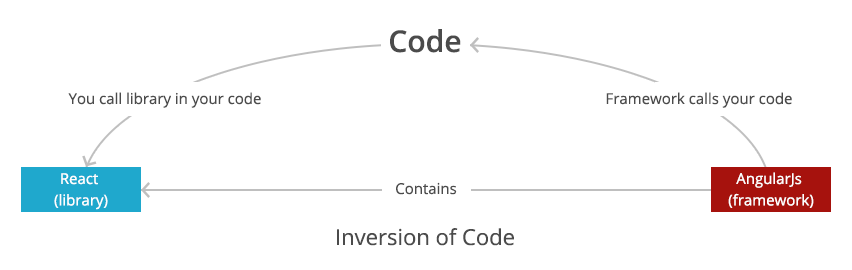
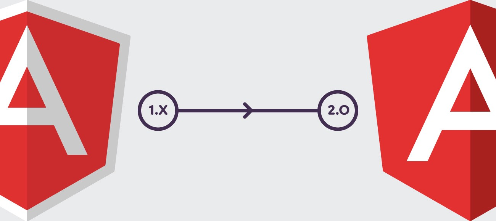
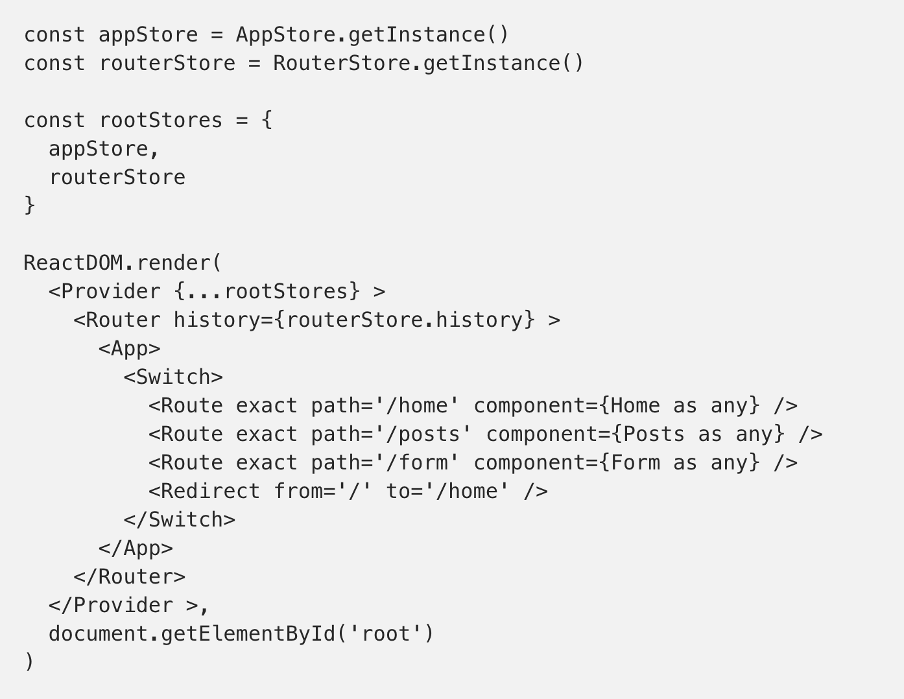
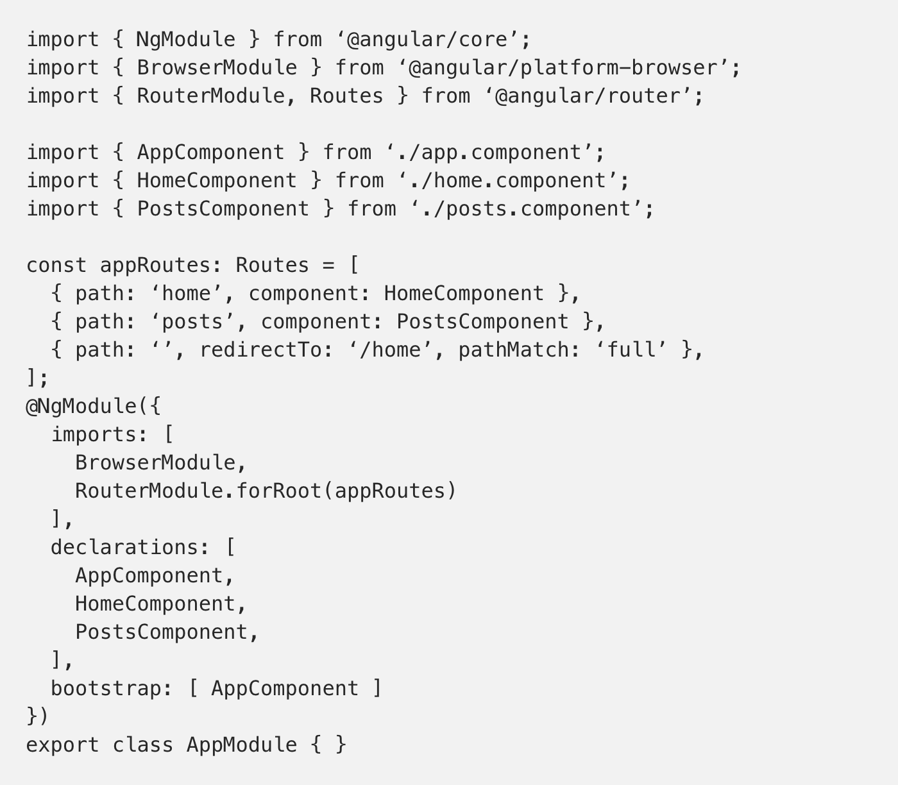
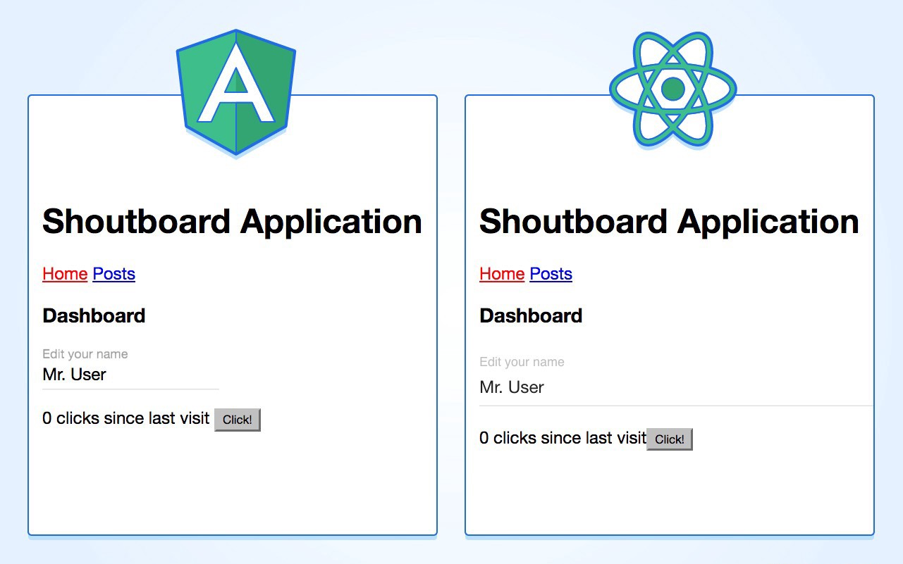

Angular & React her iki mimarinin de javascript dünyasında popülaritesi son zamanlarda çok arttı. Front-end geliştiricilerinin en çok sorduğu soru;

“bu mimarilerin hangisini projem için uygun olur? Hangisini kullanmalıyım?”

Gibi araştırmalar yapmak ve projeyi en sağlıklı ortam da nasıl ayağa kaldırırım ve geliştiririm gibi sorulardı. Bu yazımda da her ikisinin de proje ortamında deneyimlediğim süreçlerini sizinle paylaşmak istedim.

Her iki mimarinin yapısı çok fazla karşılaştırılsa da aslında temel farklardan birtanesi, Angular’ın framework, React’ın ise kütüphane olmasıdır.

Önyüz’de performans test’leri yapılırken bunu da dikkate almakta fayda var. Geliştirilecek olan projenin mimarisi, önyüz tarafında rander olacak sayfa sayısı-yapısı ne kadar iyi ön görülürse eğer o kadar sağlıklı bir altyapı kurulur. Bu noktada, projenin sayfa bazlı birbirleri ile ilişkisini gözlemlemek, ortak bir component yapısı kurgulamak bu noktada devreye giriyor.

Bazen her gün yeni çıkan mimarileri, kullanılacak araç toolarını duymaya başlıyoruz. Çıkan her yeniliğin projeye sağladığı avantajları saplamak zor bir karar olabiliyor.

Projenin ya da projelerin yaşam döngüsü önyüz tarafında sadece bunlarla da sınırlı kalmıyor. Bununla ilgili yazım, “Proje süreçlerinde önyüz mimarisine pure yaklaşım” konusundan inceleyebilirsiniz.

## Angular2

Angular, Angularjs olarak ilk 20 Ekim 2010 tarihinde piyasaya sürüldü. Bu süre zarfında, Jquery’nin yaptığı dom manipulasyon işlemleri, bindign işlemleri ve yazılan kodun birden çok alanda etkileşimde olması modüler anlamda çok avantaj sağladı.

İlk olarak angularjs’in çıkış noktasına baktığımızda bir framework olmakla birlikte jquery’inin temelde yaptığı client side işlemlerini üstlenmesi ve template yapısının içermesiydi, bir web sitesini web uygula gibi düşünülmesi de bu noktada avantaj sağlıyordu.

## Reactjs

Angular ve Reactjs her ikisi de open source projelerdir. Aradaki farklar’dan birisi aslında Angular’ın framework olması, react’ın ise kütüphane olmasıdır. Reactjs facebook tarafından geliştirilen bir kütüphanedir.

Facebook sayfasını düşünürsek eğer, ortak kullanılan component sayısı bir hayli fazla. Facebook sohbet component’i buna bir örnektir. Ve buna benzer birçok sayfa içerisinde kullanılan component’ler. Özetinde farklı bileşenleri farklı controller altında işlemeyi avantaj kılmaktadır.

Reactjs’in yapısı Angular2'ye göre farklı dmeiştik. React, observer design pattern kullanır. Yani nesne yönelimli programlama anlamına da gelir. React bu sayede, stage’te olan değişiklikleri gözlemler ve ui tarafında dom’un tekrar oluşturulmasını sağlar.

# Peki nasıl stage değişikliği sağlıyor?

*Virtual dom, gerçek Dom’a karşılık gelen sanal bir DOM mekanizmasıdır. Asıl DOM’un kopyası gibi düşünebiliriz. React stage üzerindeki değişiklikleri izlediğinde Viritual dom devreye girer.. Bu sayede gerçek dom ile sanal dom arasındaki farklılıkları tesbit eder, gerçek dom’da yapılacak değişiklikleri hesaplar ve tek seferde gerçek DOM’a değişen elemanları rander eder.. Bu sayede stage değiştiğinde ana DOM’un tüm elemanlarının yüklenmesi maliyetini ortadan kaldırmış olur.*

## Data Binding

Veri bağlama, tek yönlü yaklaşıma göre tartışılması daha kolaydır. Ancak tek yönlü yaklaşıma göre datanın işlenmesi adına daha verimli sonuç elde etmek mümkün. React ile Redux veya mobx-state-tree kullanımın da ya da Angular ngrx kullanımı buna bir örnektir.

## Routing

Temel olarak uygulamada kullanmak istediğimiz bileşenleri bir araya getirmek React ve Angular’da farksız aslında. Aşağıdaki her iki örnekteki gibi her sayfanın bir bileşen olarak bir Router’a bağlı olduğunu görebiliriz.

Her iki bileşenin uygulamanın da önyükleme bileşenleri oldukça basit. Reactjs’in farkı biraz daha moduler bileşenleri iç içe kullanmak kolay olması. Buna ek olarak JSON kullanarak dinamik sayfanın oluşturulması her iki yapı da da basit. Sadece bu biraz daha tercih meselesi.

Her iki yapı için karşılaştırmalı örnek;

- Shoutboard Angular
- Shoutboard React

İki aynı uygulama üzerinde performans ve çalışma ortamlarına [link](https://goo.gl/qQxoVP) üzerinden ulaşabilirsiniz.